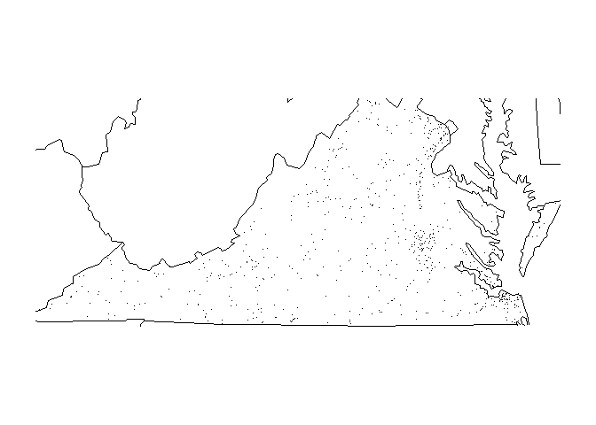

<!-- README.md is generated from README.Rmd. Please edit that file -->
| Current Travis Build Status | [](https://travis-ci.org/RussellPolitzky/fars) |
|-----------------------------|---------------------------------------------------------------------------------------------------------------------------------------|

FARS Analysis Functions
=======================

FARS is the **F**atal **A**ccident **R**eporting **S**ystem. Fatal Accident Reports provide details, such as the time and location of each accident. The `fars` package provides a set of simple functions to load and analyze this data.

Installation
------------

The `fars` package may be installed using `devtools` as follows:

``` r
devtools::install_github("RussellPolitzky/fars")
```

`make_file_name()`
------------------

FARS, CSV data files have names with the following form:

    accident_xxxx.csv.bz2

Where `xxxx` is the year expressed as a four digit number. For example, the FARS file for 2013 is:

    accident_2013.csv.bz2

Givent the year, `make_file_name()` generates this file name:

``` r
library(fars)

fars_file <- make_filename(2013)
fars_file
#> [1] "accident_2013.csv.bz2"
```

`fars_read()`
-------------

Given the year of interest, `fars_read()` will read the associated FARS, CSV data file into a `data.frame`.

``` r
fars_file <- make_filename(2013)
fars_data <- fars_read(fars_file)
fars_data
#> # A tibble: 30,202 × 50
#>    STATE ST_CASE VE_TOTAL VE_FORMS PVH_INVL  PEDS PERNOTMVIT PERMVIT
#>    <int>   <int>    <int>    <int>    <int> <int>      <int>   <int>
#> 1      1   10001        1        1        0     0          0       8
#> 2      1   10002        2        2        0     0          0       2
#> 3      1   10003        1        1        0     0          0       1
#> 4      1   10004        1        1        0     0          0       3
#> 5      1   10005        2        2        0     0          0       3
#> 6      1   10006        2        2        0     0          0       3
#> 7      1   10007        1        1        0     0          0       1
#> 8      1   10008        2        2        0     0          0       2
#> 9      1   10009        1        1        0     0          0       1
#> 10     1   10010        2        2        0     0          0       4
#> # ... with 30,192 more rows, and 42 more variables: PERSONS <int>,
#> #   COUNTY <int>, CITY <int>, DAY <int>, MONTH <int>, YEAR <int>,
#> #   DAY_WEEK <int>, HOUR <int>, MINUTE <int>, NHS <int>, ROAD_FNC <int>,
#> #   ROUTE <int>, TWAY_ID <chr>, TWAY_ID2 <chr>, MILEPT <int>,
#> #   LATITUDE <dbl>, LONGITUD <dbl>, SP_JUR <int>, HARM_EV <int>,
#> #   MAN_COLL <int>, RELJCT1 <int>, RELJCT2 <int>, TYP_INT <int>,
#> #   WRK_ZONE <int>, REL_ROAD <int>, LGT_COND <int>, WEATHER1 <int>,
#> #   WEATHER2 <int>, WEATHER <int>, SCH_BUS <int>, RAIL <chr>,
#> #   NOT_HOUR <int>, NOT_MIN <int>, ARR_HOUR <int>, ARR_MIN <int>,
#> #   HOSP_HR <int>, HOSP_MN <int>, CF1 <int>, CF2 <int>, CF3 <int>,
#> #   FATALS <int>, DRUNK_DR <int>
```

`fars_read_years()`
-------------------

Most users will want to load several FARS data files, by year, without having to generate the associated file names. `fars_read_years()` makes this possible. The function takes a vector of years and a list of `data.frame`s; one for each given year.

``` r
all_data <- fars_read_years(c(2013, 2014, 2015))
head(all_data)
```

The resulting list of `data.frame`s may, be subsequently combined, and analyzed as a whole.

`fars_summarize_years()`
------------------------

This function generates a summary of fatalities per month, for the given vector of years. `fars_summarize_years()` takes a single argument; years; a vector/list of years that the summary will cover.

``` r
fars_summarize_years(c(2013, 2014, 2015))
#>     MONTH 2013 2014 2015
#>  1:     1 2230 2168 2368
#>  2:     2 1952 1893 1968
#>  3:     3 2356 2245 2385
#>  4:     4 2300 2308 2430
#>  5:     5 2532 2596 2847
#>  6:     6 2692 2583 2765
#>  7:     7 2660 2696 2998
#>  8:     8 2899 2800 3016
#>  9:     9 2741 2618 2865
#> 10:    10 2768 2831 3019
#> 11:    11 2615 2714 2724
#> 12:    12 2457 2604 2781
```

`fars_map_state()`
------------------

Given a state and a year, `fars_map_state` plots the location of each fatal accident which ocurred in that year. The density of plotted dots is an indication of the number of fatal accidents in a given area.

``` r
library(maps)
data(stateMapEnv)
fars_map_state(51, 2013)
```



Sample Data
===========

This package ships with the following sample data files.

    accident_2013.csv.bz2
    accident_2014.csv.bz2
    accident_2015.csv.bz2

These files may be read using `system.file()` as follows:

``` r
# Get full path to sample, fars data file.
file_name <- make_filename(2013)
full_path <- system.file("extdata", file_name, package = "fars")

# Load the fars data file.
fars_data <- fars::fars_read(full_path)
head(fars_data)
#> # A tibble: 6 × 50
#>   STATE ST_CASE VE_TOTAL VE_FORMS PVH_INVL  PEDS PERNOTMVIT PERMVIT
#>   <int>   <int>    <int>    <int>    <int> <int>      <int>   <int>
#> 1     1   10001        1        1        0     0          0       8
#> 2     1   10002        2        2        0     0          0       2
#> 3     1   10003        1        1        0     0          0       1
#> 4     1   10004        1        1        0     0          0       3
#> 5     1   10005        2        2        0     0          0       3
#> 6     1   10006        2        2        0     0          0       3
#> # ... with 42 more variables: PERSONS <int>, COUNTY <int>, CITY <int>,
#> #   DAY <int>, MONTH <int>, YEAR <int>, DAY_WEEK <int>, HOUR <int>,
#> #   MINUTE <int>, NHS <int>, ROAD_FNC <int>, ROUTE <int>, TWAY_ID <chr>,
#> #   TWAY_ID2 <chr>, MILEPT <int>, LATITUDE <dbl>, LONGITUD <dbl>,
#> #   SP_JUR <int>, HARM_EV <int>, MAN_COLL <int>, RELJCT1 <int>,
#> #   RELJCT2 <int>, TYP_INT <int>, WRK_ZONE <int>, REL_ROAD <int>,
#> #   LGT_COND <int>, WEATHER1 <int>, WEATHER2 <int>, WEATHER <int>,
#> #   SCH_BUS <int>, RAIL <chr>, NOT_HOUR <int>, NOT_MIN <int>,
#> #   ARR_HOUR <int>, ARR_MIN <int>, HOSP_HR <int>, HOSP_MN <int>,
#> #   CF1 <int>, CF2 <int>, CF3 <int>, FATALS <int>, DRUNK_DR <int>
```
